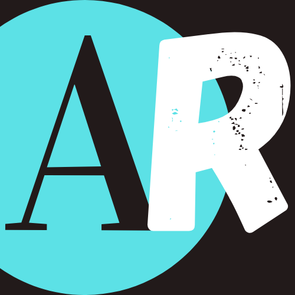

<h2 align="center">Angela Rios</h2>

<a href="https://www.linkedin.com/in/angela-rios29/">Linkedin |</a>
<a href="https://github.com/angieRi">GitHub |</a>
<a href="https://gitlab.com/angie_ri"> GitLab</a>

## Portfolio Laravel-React

Este proyecto está realizado con el framework Laravel del lado de backend, React del lado del frontend, 
MySql en la base de datos entre otras tecnologías, con ayuda de tutoriales integré React con laravel.  
Esta página consta de las siguientes partes:

- **Inicio**
- **Acerca de mí**
- **Experiencia**
- **Portfolio**
- **Contacto**

